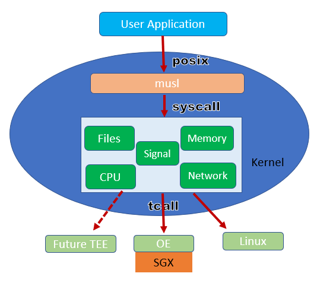

## What is Mystikos?
**Mystikos** is a runtime and a set of tools for running Linux applications
in a hardware trusted
execution environment (TEE). The current release supports **Intel &reg; SGX**
while other TEEs may be supported in future releases.

## Goals

- Enable protection of application code and data while in memory through the
  use of hardware TEEs. This should be combined with proper key management,
  attestation and hardware roots of trust, and encryption of data at rest and
  in transit to protect against other threats which are out of scope for this
  project.
- Streamline the process of lift-n-shift applications, either native or
  containerized, into TEEs, with little or no modification.
- Allow users and application developers control over the makeup of the trusted
  computing base (TCB), ensuring that all components of the execution environment
  running inside the TEE are open sourced with permissive licenses.
- Simplify re-targeting to other TEE architectures through a plugin
  architecture.

## Architecture

**Mystikos** consists of the following components:
- a C-runtime based on [musl libc](https://musl.libc.org), but is glibc compatible
- a "lib-os like" kernel
- the kernel-target interface (TCALL)
- a command-line interface
- some related utilities

Today, two target implementations are provided:
- The **SGX** target (based on the [Open Enclave
  SDK](https://github.com/openenclave/openenclave))
- The **Linux** target (for verification on non-SGX platforms)

The minimalist kernel of Mystikos manages essential computing resources
inside the TEE, such as CPU/threads, memory, files, networks, etc. It handles
most of the syscalls that a normal operating system would handle (with
[limits](doc/syscall-limitations.md)).  Many syscalls are handled directly by the
kernel while others are delegated to the target specified while launching
Mystikos.

# Installation Guide for Ubuntu

Mystikos may be built and installed on Ubuntu 18.04 and 20.04.

## Install from Released Package

To install Mystikos using one of the released packages, please follow the appropriate guide to install on [Ubuntu 18.04](doc/user-install-ubuntu-1804.md) or [Ubuntu 20.04](doc/user-install-ubuntu-2004.md).

## Install From Source

You may also [build Mystikos from source](BUILDING.md). The build process
will install the SGX driver and SGX-related packages for you.

# Quick Start Docs

Eager to get started with Mystikos? We've prepared a few guides, starting from
a simple "hello world" C program and increasing in complexity, including
demonstrations of DotNet and Python/NumPy.

Give it a try and let us know what you think!

## Simple Applications

- A Simple "Hello World" in C: [click here](doc/user-getting-started-c.md)
- A Simple "Hello World" in Rust: [click here](doc/user-getting-started-rust.md)
- Dockerizing your "Hello World" app: [click
  here](doc/user-getting-started-docker-c++.md)
- Introducing Enclave Configuration with a DotNet program: [click
  here](doc/user-getting-started-docker-dotnet.md)
- Running Python & NumPy for complex calculations: [click
  here](doc/user-getting-started-docker-python.md)

## Samples
Mystikos [samples](/samples) provides a number of samples in various programming
languages and serves as a good place for developers to start.

## Enclave Aware Applications

Sometimes, you want to take advantage of specific properties of the Trusted
Execution Environment, such as attestation. The following example shows how to
write a C program which changes its behaviour when it detects that it has been
securely launched inside an SGX enclave.

- Getting started with a TEE-aware program: [click
  here](doc/user-getting-started-tee-aware.md)

## More Docs!

We've got plans for a lot more documentation as the project grows, and we'd
love your feedback and contributions, too.

- Key features of Mystikos: [click here](doc/key-features.md)
- General concepts of Mystikos: [click here](doc/user-getting-started.md)
- Deep dive into Mystikos architecture: [coming soon]
- How to implement support for a new TEE: [coming soon]
- Kernel limitations: [click here](doc/kernel-limitations.md)
- Multi-processing and multi-threading in Mystikos and limitations: [coming
  soon]

# Developer Docs

Looking for information to help you with your first PR? You've found the right
section.

- Developer's jump start guide: [click here](doc/dev-jumpstart.md)
- Signing and packaging applications with Mystikos: [click
  here](doc/sign-package.md)
- Release management: [click here](doc/releasing.md)
- Notable unsupported kernel features and syscalls: [coming soon]

For more information, see the [Contributing Guide](CONTRIBUTING.md).

# Licensing

This project is released under the [MIT License](LICENSE).

# Reporting a Vulnerability

**Please DO NOT open vulnerability reports directly on GitHub.**

Security issues and bugs should be reported privately via email to the
[Microsoft Security Response Center](https://www.microsoft.com/en-us/msrc)
(MSRC) at secure@microsoft.com. You should receive a response within 24 hours.
If for some reason you do not, please follow up via email to ensure we received
your original message.

# Code of Conduct

This project has adopted the
[Microsoft Code of Conduct](https://opensource.microsoft.com/codeofconduct/).
All participants are expected to abide by these basic tenets to ensure that the
community is a welcoming place for everyone.

# Test
Commit to test PR functionality
