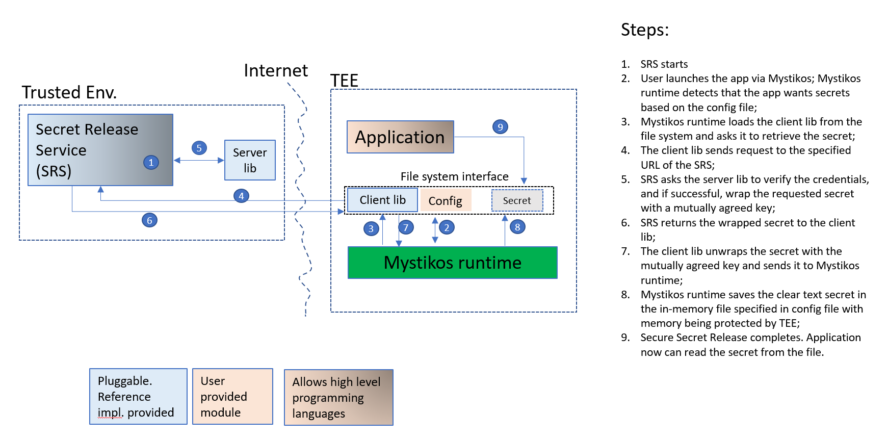

# Flexible Secret provisioning with Mystikos

For confidential computing applications, we don't recommend that the
application code to contain any secrets, as the code (either in source
or binary forms) could be exposed to hostile environment during
downloading, uploading, copying, or launching of the application.
Instead, we recommend the secrets to be securely released to the
application while it is executed in a Trused Execution Environment (TEE).
The providers of the secrets could be a key vault service such as AKV,
M-HSM, or a service run by the user in a locked down and trusted
environment.

This design document describes the process of secret provisioning
 with Mystikos in 5 aspects:

1. **the user interface**: how does Mystikos allow users to specify the
secrets they want in their applications?
1. **the client library**: how does Mystikos provide a reference SSR
client library and how can users plug in an alternative library.
1. **the server library**: how does Mystikos provide a reference SSR
server library and how can users plug in an alternative library.
1. **the secret release service**: how does the secret holder use the
server library for secure release of secrets.
1. **the attestation model**: the evidences and the verification of
such evidences agreed by both the client and the server.

## The user interface

Users who wish to provision secrets to their applications running with
Mystikos can add the following section to config.json:

```json
secrets: [
    # Secret 1
    {
        "Name": <name of the secret>,
        "AttestationModel": <a number between 1 to 3. See attestation models below>
        "HolderURL": <URL to the secret release service>,
        "Kid": <identifier of the key>,
        "LocalPath": <Path to the file that will store the secret after its retrieval>,
        "ClientLibPath": <Path to the client library>
    },
    # Secret 2
    {
        "Name": <name of the secret>,
        "AttestationModel": <a number between 1 to 3. See attestation models below>
        "HolderURL": <URL to the secret release service>,
        "Kid": <identifier of the key>,
        "LocalPath": <Path to the file that will store the secret after its retrieval>,
        "ClientLibPath": <Path to the client library>
    },
    ...
]
```

Users are responsible for getting the dependent client library into the rootfs consumed
by Mystikos. They are also responsible to linking with the corresponding server library
in their services that release the secrets.

## Attestation models

At present, we consider 3 attestation models, from 1 to 3, that can be adopted by the
client library while it generates attestation evidences, and by the server library
when it verifies such evidences. Higher number indicates more abstraction in the
attestation model.

* **model 1**: The client generates a key pair, and an attestation report which
includes the hash of the public key. The public key (but not the private key)
and the attestation report are sent to the server. The server will verify the report's
validity, verify the public key hash, and consider the TEE identity while
deciding whether to release the secret or not.

* **model 2**: The client generates a self-signed x509 certificate with
an embedded attestation report which includes the hash of the public key.
The certificate is sent to the server. The server will verify the
report's validity, verify the public key hash, and consider the TEE
identity while deciding whether to release the secret or not.

* **model 3**: The client generates attestation evidences necessary to obtain
a token from an attestation service, such as MAA. The token is sent to the
server. The server will verify the validity of the token, and verify various
claims within the token, including but not limited to public key and TEE
identity, while deciding whether to release the secret or not.

The reference implementation will use SGX report for attestation purposes. This
does not limit users from providing their own client/server libraries that
take advantage of attestation capabilities provided by other TEE platforms such
as AMD SNP.

## The client library

Mystikos will provide a reference implementation of the client library
that exposes the following APIs to be called by Mystikos runtime while
performing secret provisioning:

* `generate_attestation_evidence_with_keys` (for attestation model 1)
* `generate_x509_cert_with_attestation_extension` (for attestation model 2)
* `generate_attestation_service_token` (for attestation model 3)
* `unwrap_secret` (for all attestation models)

A client library could choose to implement only 1 or 2 `generate_xxx` functions
for the specific attestation models supported on the server side. For example,
the client library we provide for Azure M-HSM only implements
`generate_attestation_service_token` (attestation model 3)
because that's the only model M-HSM service supports.

The reference implementation provided by Mystikos will support all 3
attestation models relying on the extended syscalls offered by Mystikos
runtime. However, it only supports the minimum requirement for
a secret provisioning process. Any additional security enhancements, such as
using nonce or signing and verifying the response from the server could be
implemented in custom client/server libraries as long as the enhancement
is agreed on by both the client and the server, and the implementation
fulfills the same set of APIs.

Users can plug in their own client library by including the library in rootfs
and providing the corresponding `ClientLibPath` in config.json.

The client library is expected to be written in C/C++.

## The server library

Mystikos will provide a reference implementation of the server library
that exposes the following APIs to be called by the service that releases the
secrets:

* `verify_attestation_evidence_with_key` (for attestation model 1)
* `verify_x509_cert_with_attestation_extension` (for attestation model 2)
* `verify_attestation_service_token` (for attestation model 3)
* `wrap_secret` (for all attestation models)

A server library could choose implement only 1 or 2 `verify_xxx` functions above for the
attestation models it supports. In `wrap_secret`, our reference implementation
just encrypts the secret with the public key. A more complex implementation could add
signing, the allowed operations on the released secret, or include the original request
parameters in the response as long as the corresponding client library implements
`unwrap_secret` accordingly.

How does the server lib verify the attestation report is a contract between the
client lib and the server lib. For the attestation report generated by our reference
client lib implementation, the SGX report can be verified using either:

1. Open Enclave host verify library;
1. the extended syscalls of Mystikos if the secret release service runs inside
Mystikos;
1. the MAA service.

We will probably implement the simplest one in the reference implementation.

The server library is preferably to be written in C/C++ if it depends on the OE library
or the Mystikos extended syscalls.

## The Secret Release Web Service

The Secret Release Web Service (SRWS) could be run in a trusted environment.
We recommend, but don't mandate, it to be run in a TEE. That is, we encourage
users to run SRWS with Mystikos. But you could run it on a plain Linux or Windows
server as long as you have confidence in the measures that safeguard the server.

For testing purpose, Mystikos will provide a simple web service that links with
the reference implementation of the server library and performs secret release.

The Secret Release Web Service can be implemented in any programming language.

## Putting everything together


