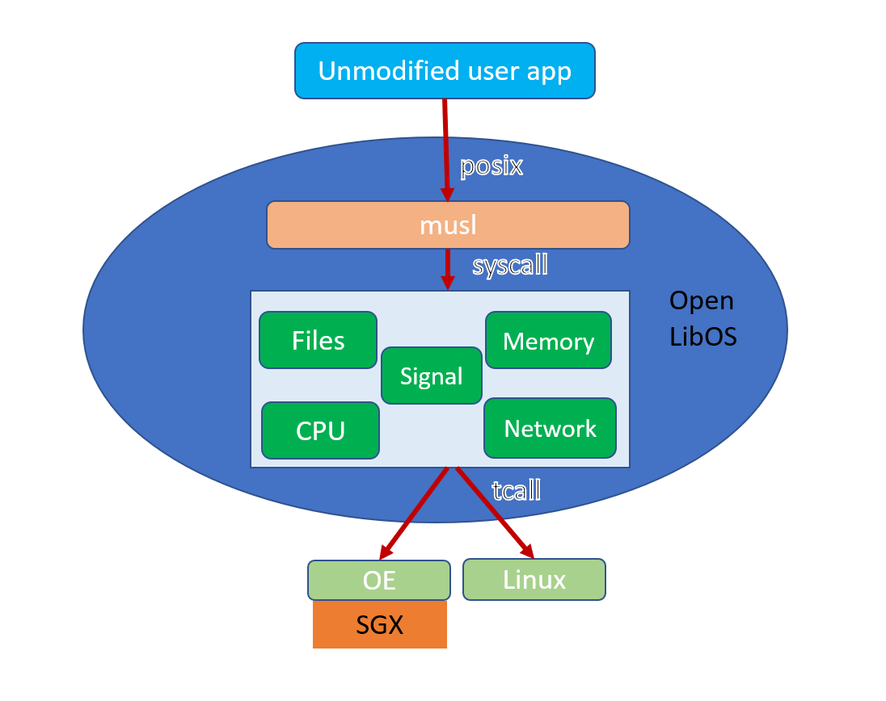

# Open LibOS Developer's Jumpstart Guide

## Introduction

Open LibOS provides a lift-n-shift solution for running user applications in a trusted execution environment (TEE). In most cases,
users don't have to modify their applications to run with Open LibOS. As the benefits of running with Open LibOS, user applications
automatically:

* Run in a protected memory region that no other processes, including OS and VMM, can access. The attempt to read/write the memory
from outside usually leads to crashes.
* could obtain evidences from the TEE/libOS to attest to relying parties that the application is running in a TEE with certain identity.
* could approve or reject evidences from a peer either running with another instance of Open LibOS or built with
[Open Enclave SDK](https://github.com/openenclave/openenclave).



Open LibOS consists of:
* At the top layer, a libc library based on [MUSL](https://www.musl-libc.org/). Applications call into this layer with standard
POSIX libc interfaces;
* In the middle layer, a kernel library that handles the syscalls from the upper layer, and manages the computing resources, e.g., files,
memory, etc. The libc library calls into this layer with standard Linux syscall interfaces;
* In the bottom layer, a target library that provides common platform support to the kernel. The kernel library calls into the layer
with a target-agnostic interface.


## Get and browse the code

1. Request access to the repo by emailing mikbras@microsoft.com and. This will become unnecessary once the project goes public.
1. Create an Acc VM with Ubuntu 18.04 image.
1. Clone the repo with: `git clone https://github.com/mikbras/oe-libos.git`

Under the root directory, we have:
*  `third_party/enclave-musl` folder that implements the libc library;
* `kernel` that implements the kernel library;  and
* `target` that implement a few targets we support so far.
* Specifically for the SGX target, folder `third_party/openenclave` provides enclave related functions with OE SDK. We use a feature
 branch from the OE SDK repo, which is kept in sync with the master branch.

Also under the root directory:

* The `tests` folder contains test cases we run for CI/CD pipelines.
* The `solutions` folder contains sophisticated applications we can run with Open LibOS. They are also covered by the CI/CD pipeline.
* The `samples` folder contains test cases for evolving features which are not stable enough to be moved into `tests`.
* The `scripts` folder contains several helper scripts for using Open LibOS or integrating with the pipeline.
* The `tools` folder contains a SGX enclave that bootstraps Open LibOS, as well as its launcher.


## Try it out

The following instructions assume Open LibOS is cloned to `$HOME/oe-libos`.
1. **Install prerequisite packages**: the quickest way is to have Open LisOS do it for you:
    ```
    cd oe-libos; make
    ```
    The build process will pull down a large number of packages and install them on the VM.
1. The `make` command creates a `build` folder under `oe-libos`, which consists of the following artifacts:
    *  bin: the executables of Open LibOS, including:
        * the main executable `libos`
        * the debugger `libos-gdb`
    * host-musl, including:
        * musl-gcc, which is used to compile the enclave-musl, kernel and target libraries
    * lib, including:
        * liboscrt.so, the output from building `enclave-musl`
        * liboskernel.so, the output from building `kernel`
        * libostarget*.a, the output from building target libraries
        * openenclave/libosenc, the output from building `tools/libos/enc`
    * openenclave, including the outputs from building OE SDK.
1. Run a simple application built with musl-gcc
    ```
    cd oe-libos/tests/hello
    make
    make tests
    ```
    In the 2nd step `make`, we create a temporary folder `appdir`, compile `hello.c` with `musl-gcc`, and place the output
    executable under `appdir/bin/hello`, finally we create a CPIO archive out of `appdir`.

    In the 3rd step `make tests`, we launch `libos`, giving it the CPIO archive, the command to run (`/bin/hello` in this case), and
    finally, the command line arguments, e.g., "red", "green", and "blue". With this step, we should see the following outputs:
    ```
    Hello world!
    I received: argv[0]={/bin/hello}, argv[1]={red}, argv[2]={green}, argv[3]={blue}
    ```
1. Run an existing application included in Alpine Linux

    [Alpine Linux](https://alpinelinux.org/) is a Linux distribution that uses MUSL as its libc implementation. Since Open LibOS provides
    a libc interface based on MUSL, many applications included in Alpine Linux could be run with Open LibOS without modification.
    ```
    cd oe-libos/tests/alpine
    make
    make tests
    ```
    In the 2nd step, we download and extract a version of `alpine-minirootfs`, put it under `appdir`, and create a CPIO archive out of `appdir`.

    In the 3rd step, we execute command `ls` on the CPIO archive with `libos`.

## Advanced experiments

1.  Run an application built with a docker container based on Alpine Linux with a default Dockerfile

    When an application depends on 3rd party libraries, we should use docker containers that based on Alpine Linux to install the
    necessary packages and then build the application. We provide a default dockerfile `oe-libos/alpine/Dockerfile` for building some
    of our tests/samples.
    ```
    cd oe-libos/samples/goodbye
    make
    make run
    ```
    In the 2nd step, we launch a docker container with a pre-built image out of `oe-libos/alpine/Dockerfile`, and compile the
    application `goodbye.c`. Again, the build outputs are placed under `appdir` which is converted into a CPIO archive.

1. Run an application built with a docker container based on Alpine Linux with a customized Dockerfile

    The default dockerfile `oe-libos/alpine/Dockerfile` includes packages such as `build-base`, `mbedtls-dev`, and `curl`. For
    applications that depend on libraries not included in the default dockerfile, we need to provide a customized Dockerfile.
    ```
    cd oe-libos/solutions/attested_tls
    make run
    ```
    During `make run`, we use a customized dockerfile `oe-libos/solutions/attested_tls/Dockerfile` to create a docker image, and then
    launch it to build the application. We use the script `appbuilder` to automate the process.

## Debugging

1. For most applications under `tests`, we can launch the debugger with command `make tests GDB=1`. For example:
    ```
    cd oe-libos/tests/hello
    make && make tests GDB=1
    ```

1. Once inside the gdb window, we can set two breakpoints to examine the events during booting Open LibOS and launching user applications.
    ```
    break main
    break libos_enter_crt
    run
    ```

1. The first breakpoint should be hit at the `main` function in `oe-libos/tools/libos/host/host.c`. This is the launcher for the
bootstrapping enclave.

1. Enter `continue` command to gdb, the second breakpoint should be hit at the `libos_enter_crt` function in `oe-libos/crt/enter.c`.

1. The `where` command to gdb reveals that we have gone through the following events to reach the point of starting C-runtime (CRT):

    * **libos_enter_ecall**, where we cross the boundary between OE host (the launcher) and the bootstrapping enclave.
    * **libos_enter_kernel**, where we cross the boundary between the bootstrapping enclave and the kernel.
    * **libos_enter_crt**, where we cross the boundary between the kernel and CRT

1. Enter `continue` command to gdb, the third breakpoint should be hit at the `main` function in the user application.
1. Now in the GDB window, set a breakpoint to observe how Open LibOS handles syscalls.
    ```
    break libos_syscall
    continue
    where
    ```
1. Experiment with more gdb commands and breakpoints.


