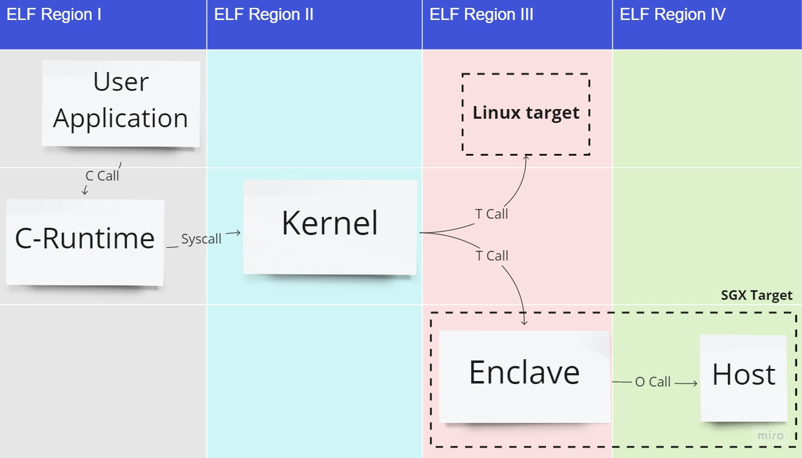

# Mystikos Developer's Jumpstart Guide

This document contains an overview of the code layout and development model, to help a new developer get started writing code for the project. It's a good read before your first PR.

## Browsing the source code

Please see [README](../README.md) for how to obtain the source code.

Under the root directory, we have:
*  `third_party/musl/crt` folder that implements the libc library based on
MUSL;
* `kernel` that implements the Mystikos kernel;
* `target` that implements a few targets we support so far;
* `tools` that implements `myst` command, the primary tool of Mystikos;
* Specifically for the SGX target, folder `third_party/openenclave` provides
enclave related functions. We use a feature branch from the OpenEnclave SDK
repo.

Also under the root directory:

* The `tests` folder contains test cases we run for CI/CD pipelines.
* The `solutions` folder contains sophisticated applications we can run with
Mystikos. They are also covered by the CI/CD pipeline.
* The `samples` folder contains test cases for evolving features which are
not stable enough to be moved into `tests`.
* The `scripts` folder contains several helper scripts for using Mystikos
or integrating with the pipeline.

Other directories include:

* `alpine`: contains the Docker image used by some tests
* `art`: contains graphical resources used in documentation
* `asm`: contains assembly code
* `crt`: contains Mystikos's addition to musl library
* `doc`: contains documentations
* `docker`: contains files to build Mystikos in a container
* `ext2`: contains EXT2 file system implementation
* `gcov`: contains gcov-based code coverage utilities
* `host`: contains files used by the host launcher of Mystikos
* `hostfs`: a file system primarily used for testing/debugging
* `include`: contains Mystikos header files
* `json`: a json parser implementation, primarily used to parse configuration file
* `oe`: contains extension to OpenEnclave, exposing OE APIs through syscalls
* `prereqs`: contains prerequisite such as Intel SGX driver and other required application packages
* `utils`: contains various utility files

## Trying it out

Please see [README](../README.md) for how to install the pre-requisite packages
and build the source code.

The following instructions assume Mystikos is cloned to `$HOME/Mystikos`,
referred to as `project root` hereafter.

1. The build process creates a `build` folder under the project root, which
consists of the following artifacts:
    * bin: the executables of Mystikos, including:
        * the main executable `myst`
        * the debugger `myst-gdb`
    * lib: including:
        * libmystcrt.so, the output from building `third_party/musl/crt`
        * libmystkernel.so, the output from building `kernel`
        * mysttarget*.a, the output from building target libraries
        * openenclave/mystenc.so, the output from building `tools/myst/enc`
    * openenclave, including the outputs from building OE SDK.
1. Run a simple application built with gcc
    ```bash
    cd tests/hello_world/c
    make
    make tests
    ```
    During the 2nd step `make`, it creates a temporary folder `appdir`, compile
    `hello.c` with `gcc`, and place the output executable under
    `appdir/bin/hello`, finally we create a CPIO archive out of `appdir`.

    During the 3rd step `make tests`, it launchs `myst`, giving it the CPIO
    archive, the command to run (`/bin/hello` in this case), and
    the command line arguments, e.g., "red", "green", and "blue".
    With this step, we should see the following outputs:
    ```
    Hello world!
    I received: argv[0]={/bin/hello}, argv[1]={red}, argv[2]={green}, argv[3]={blue}
    ```
1. Run an existing application included in Ubuntu

    We build a self-contained application folder using `appbuilder`. The
    output `appdir` directory contains the executables and libraries bundled in
    an Ubuntu base image. We create a CPIO archive out of `appdir` and then
    execute command `ls` with `myst`.

    ```bash
    appbuilder -i ubuntu:18.04
    myst mkcpio appdir rootfs
    myst exec-sgx rootfs /bin/ls /
    ```

## Advanced experiments

1. Run a user application based on a Linux container. The base OS could be
Ubuntu, Redhat, Alpine, or other distros.

    ```
    cd solutions/attested_tls
    make && make run
    ```
    During `make`, we use `appbuilder` to generated a self contained
    application folder `appdir` from dockerfile  `solutions/attested_tls/Dockerfile`,
    and convert that into a CPIO archive. `make run` will launch `myst` command
    which in turn launch the application located in the CPIO archive.

## Debugging

Mystikos currently can be run on two targets, SGX Target or Linux Target. When run on SGX Target, we have four ELF partitions, and on the Linux Target we have three ELF partitions (as shown in Fig 1). It is possible that the different ELF regions have the same function symbol repeated in them, eg: having two `main()` functions; in this case, if you set a breakpoint on `main`, GDB will consider both of them as breakpoints.

 Fig 1

C Call -> Call from the user application to the C-Runtime

Syscall -> Calls into the kernel

T Call -> Target call/calls into the target

O Call -> Calls into the host (untrusted environment)

1. For most applications under `tests`, we can launch the debugger with
command `make tests GDB=1`. For example:
    ```
    cd tests/hello_world/c
    make && make tests GDB=1
    ```
    For applications that are run in [package mode](../solutions/dotnet/Makefile#23), ensure that the field `"Debug":1` is set in the `config.json` file, and the debugger can be launched using the run command:
    
    ```
    myst-gdb --args myst/bin/<appname> <opts>
    ```

1. Once inside the gdb window, we can set two breakpoints to examine the
events during booting Mystikos and launching user applications.
    ```
    break main
    break myst_enter_crt
    run
    ```

1. The first breakpoint should be hit at the `main` function in
`Mystikos/tools/myst/host/host.c`. This is the host launcher for the
bootstrapping enclave.

1. Enter `continue` command to gdb, the second breakpoint should be hit
at the `myst_enter_crt` function in `Mystikos/crt/enter.c`.

1. The `where` command to gdb reveals that we have gone through the
following events to reach the point of starting C-runtime (CRT):

    * **myst_enter_ecall**, where we cross the boundary between the
    host launcher and the bootstrapping enclave.
    * **myst_enter_kernel**, where we cross the boundary between
    the bootstrapping enclave and the kernel.
    * **myst_enter_crt**, where we cross the boundary between the
    kernel and CRT

1. Enter `continue` command to gdb, the third breakpoint should be hit
at the `main` function in the user application.
1. Now in the GDB window, set a breakpoint to observe how Mystikos
handles syscalls.
    ```
    break myst_syscall
    continue
    where
    ```
1. Experiment with more gdb commands and breakpoints.


