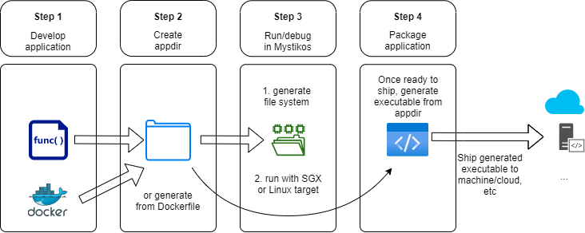

# Getting started - general concepts

This document contains general concepts that will help you better use Mystikos.

## App development workflow

This section will illustrate the common workflow when developing application in Mystikos.



1. Develop the application using programing languages / libraries / frameworks of your choice.
2. Create and populate a `appdir` directory that contains your compiled application and necessary dependencies.
   1. You could manually create this folder, or, preferably,
   2. Create a `Dockerfile` just like you normally would when dockerizing an app, then use [scripts/appbuilder](/scripts/appbuilder) (or `myst-appbuilder` if you have Mystikos installed) to automatically generate `appdir` directory given the `Dockerfile`. Please see [Getting started Docker C++ app](/doc/user-getting-started-docker-c++.md) for an example.
3. For developing/running/debugging your application in Mystikos:
   1. First create a root file system (rootfs) from `appdir`. There are 2 options, you could create a CPIO archive by using `myst mkcpio`, or an EXT2 image by using `myst mkext2`, to learn more about file system support in Mystikos, please check [Running Simple Applications](/doc/running-simple-app.md)
   > This file system will contain everything needed to run your application, if you made some change to the application or its dependency, you will need to generate this again.
   2. Then run your application by using `myst exec-sgx` or `myst exec-linux`
      1. Today, two target implementations are provided: SGX and Linux
         1. The SGX target will run an application in a trusted SGX environment (requires supported hardware)
         2. The Linux target will run an application in a untrusted Linux environment, this is used only for debugging
4. For making your application production ready
   1. Once you decide to deploy your application, we recommend signing and packaging it, you can check [Signing and packaging an application with Mystikos](/doc/sign-package.md) for more details.

## Understand Mystikos Execution Targets

As mentioned in section 3.ii above, when running your application for developing, you can choose from SGX Target or Linux Target. The main difference is that `myst exec-sgx` will run your application inside TEE (requires hardware support) while `myst exec-linux` will simply run in the unprotected environment just like any other applications.

However, running on Linux target doesn't mean that your program is directly interacting with the host. As illustrated in the picture below, your program will still call Mystikos's runtime & kernel. This means the same Mystikos kernel limitation applies to both targets. You can checkout the two target implementation under `target/`.


When using `myst exec-sgx` or `myst exec-linux`, you can specify many arguments including the application and the arguments you'd like to pass to that application:

> For example: [tests/hello_world/java/Makefile](/tests/hello_world/java/Makefile).

```bash
$ myst exec-sgx

Usage: myst exec-sgx [options] <rootfs> <application> <args...>

Where:
    exec-sgx             -- execute an application within <rootfs> in a
                            trusted SGX environment
    <rootfs>             -- the root file system containing the application
                            (CPIO or EXT2)
    <application>        -- the path of the executable program within
                            <rootfs> that will be executed
    <args>               -- arguments to passed through to the <application>

Options:
    --help               -- this message
    --memory-size <size> -- the memory size required by the Mystikos kernel
                            and application, where <size> may have a
                            multiplier suffix: k 1024, m 1024*1024, or
                            g 1024*1024*1024
    --main-stack-size <size>
                         -- the stack size required by the Mystikos application's
                            main thread, where <size> may have a
                            multiplier suffix: k 1024, m 1024*1024, or
                            g 1024*1024*1024
    --thread-stack-size <size>
                         -- the default stack size of threads created by the
                            application, where <size> may have a
                            multiplier suffix: k 1024, m 1024*1024, or
                            g 1024*1024*1024. Ignored if smaller than the
                            existing default thread stack size
    --app-config-path <json>
                         -- specifies the configuration json file for
                            running an unsigned binary. The file can be
                            the same one used for the signing process.
    --host-to-enc-uid-map <host-uid:enc-uid[,host-uid2:enc-uid2,...]>
                         -- comma separated list of uid mappings between
                            the host and the enclave
    --host-to-enc-gid-map <host-gid:enc-gid[,host-gid2:enc-gid2,...]>
                         -- comma separated list of gid mappings between
                            the host and the enclave
    --unhandled-syscall-enosys <true/false>
                         -- flag indicating if the app must exit when
                            it encounters an unimplemented syscall
                            'true' implies the syscall would not terminate
                            and instead return ENOSYS.
    --strace            
                         -- Use this option to display the system call traces of 
                            the execution
    --strace-failing
                         -- When specified, all syscalls that fail will be logged.
                            Other syscalls will not be logged, unless specified via 
                            filter (see below). Set a breakpoint in _strace_failure_hook 
                            to stop execution whenever a syscall fails. Use breakpoint 
                            conditions to control the behavior of the breakpoint.
                            E.g: Use syscall number as a condition in the breakpoint
    --strace-filter 'SYS_name1:group1:SYS_name2:...'
                         -- Specify the set of syscalls or groups to be traced. When filters 
                            are specified, only those syscalls/groups specified in the filter 
                            will be traced, in addition to failing syscalls if
                            specified as described above. Any combination of syscalls and groups 
                            can be used. For a list of all the groups and their consituents check
                            out 'man strace' 
                            E.g: To trace open and mprotect syscalls, and 'desc' group of 
                            syscalls (file descriptor related group), specify 
                            --strace-filter 'SYS_open:SYS_mprotect:desc'
    --strace-exclude-filter 'SYS_name1:SYS_name2:group1...'
                         -- Specify a set of syscalls or groups to exclude from the strace log. 
                            All other syscalls will be logged in the strace. Failing syscalls, even 
                            if excluded, will also be logged if --strace-failing is specified. Any 
                            combination of syscalls and groups can be used.  For a list of all the 
                            groups and their consituents check out 'man strace' 
                            E.g: To exclude open and mprotect syscalls and the group of 
                            file syscalls, specify
                            --strace-exclude-filter='SYS_open:SYS_mprotect:file'
```

You can also specify many other parameters in a configuration file, conventionally called `config.json`, you will also use this configuration file to package your application.

> For full list of available parameters, please check *Application configuration for SGX enclave packaging* section in [Signing and packaging an application with Mystikos](/doc/sign-package.md).

Please note that the options present in configuration file will override those provided on the command line.

For below example, the `ApplicationPath` and `ApplicationParameters` parameter in configuration file would override `ls -l` and print `Hello` instead.

```
# config.json
{
...
   "ApplicationPath": "/bin/echo",
   "ApplicationParameters": ["Hello"],
...
}

# command line
$ myst exec-sgx rootfs /bin/ls -l --app-config-path config.json

Hello
```
